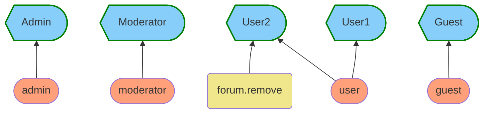

# Управление доступом на основе ролей и разрешений

Этот пакет содержит библиотеку [RBAC](https://ru.wikipedia.org/wiki/Управление_доступом_на_основе_ролей) для PHP

### Введение

#### Роли и разрешения

У каждой роли могут быть дочерние роли а также разрешения. Родительские роли наследуют все разрешения дочерних ролей.


В результате наследования разрешения каждой роли:

**роль**: _разрешения_

- **admin**: _moderator.assign_, _user.ban_, _forum.remove_, _forum.edit_, _forum.view_
- **moderator**: _user.ban_, _forum.remove_, _forum.edit_, _forum.view_
- **user**: _forum.edit_, _forum.view_
- **guest**: _forum.view_

#### Права пользователя

Каждому пользователю назначается список ролей и разрешений



### Установка

```bash
composer require shasoft/rbac
```

### Пример использования

Схема прав


Код использования схемы

```php
// Создать сервис
$rbac = new Rbac((new SQLiteDatabase('filename'))->create());
// Создать схему ролей и разрешений для пользователя
$p1 = $rbac->permission('p1');
$p2 = $rbac->permission('p2');
$p3 = $rbac->permission('p3');
$p4 = $rbac->permission('p4')->setLinkToBan(true); // Связать с баном
$R1 = $rbac->permission('R1')->permissionAdd($p1)->permissionAdd($p4);
$user = $rbac->user(1)->roleAdd($R1)->permissionAdd($p2);
// Сохранить данные в хранилище
$rbac->flush();
// Выполнить проверки
$user->can('p1'); // True
$user->can('p2'); // True
$user->can('p3'); // False
$user->can('p4'); // True
// Забанить пользователя на 5 часов
$user->setBan(new \Datetime('+5 hours'));
$rbac->flush();
// Выполнить проверки
$user->can('p1'); // True
$user->can('p2'); // True
$user->can('p3'); // False
$user->can('p4'); // False (так как разрешение связано с баном, то теперь оно не доступно)
```

#### Интерфейсы

```php
interface IRbac
{
    public function permission(string $name): IPermission;
    public function permissions(): array;

    public function role(string $name): IRole;
    public function roles(): array;

    public function user(int $userId): IUser;
    public function users(): array;

    public function reset(): IRbac;
    public function flush(): IRbac;
}

interface IUser
{
    public function delete(): void;
    public function restore(): void;
    public function hasExists(): bool;

    public function id(): int;

    public function roleAdd(IRole|string $role): IUser;
    public function roleRemove(IRole|string $role): IUser;
    public function roles(bool $all = false): array;

    public function permissionAdd(IPermission|string $permission): IUser;
    public function permissionRemove(IPermission|string $permission): IUser;
    public function permissions(bool $all = false): array;

    public function can(string $permissionName): bool;
    public function hasRole(string $roleName): bool;

    public function ban(): bool;
    public function setBan(?\DateTime $dtTo): IUser;
    public function getBan(): ?\DateTime;

    public function values(string $prefix): array;
}

interface IRole
{
    public function delete(): void;
    public function restore(): void;
    public function hasExists(): bool;

    public function name(): string;

    public function setDescription(string $value): IRole;
    public function description(): string;

    public function roleAdd(IRole|string $role): IRole;
    public function roleRemove(IRole|string $role): IRole;
    public function roles(bool $all = false): array;

    public function permissionAdd(IPermission|string $permission): IRole;
    public function permissionRemove(IPermission|string $permission): IRole;
    public function permissions(bool $all = false): array;
}

interface IPermission
{
    public function delete(): void;
    public function restore(): void;
    public function hasExists(): bool;

    public function name(): string;

    public function setDescription(string $value): IPermission;
    public function description(): string;

    public function setLinkToBan(bool $value): IPermission;
    public function hasLinkToBan(): bool;

    public function setPrefixValue(string $value): IPermission;
    public function getPrefixValue(): string;
}
```

### Поддержка пользовательских хранилищ

Для создания своего хранилище необходимо реализовать следующий интерфейс.

```php
interface IStorage
{
    public function onFlush(array $actions): void;
    public function onReset(): void;

    public function onReadPermission(array $contexts): void;
    public function onReadAllPermission(int $maxRecords, callable $cb): void;

    public function onReadRole(array $contexts): void;
    public function onReadAllRole(int $maxRecords, callable $cb): void;

    public function onReadUser(array $contexts): void;
    public function onReadAllUser(int $maxRecords, callable $cb): void;

    public function onCacheRead(string $type, string $name): ?array;
    public function onCacheWrite(string $type, string $name, array $refs): void;
    public function onCacheGets(string $type, array $refs, int $maxRecords, callable $cb): void;
    public function onCacheRemove(string $type, array $names): void;
}
```

По умолчанию в штатную поставку входит реализация хранилища для работы с [sqlite](https://www.sqlite.org/)
