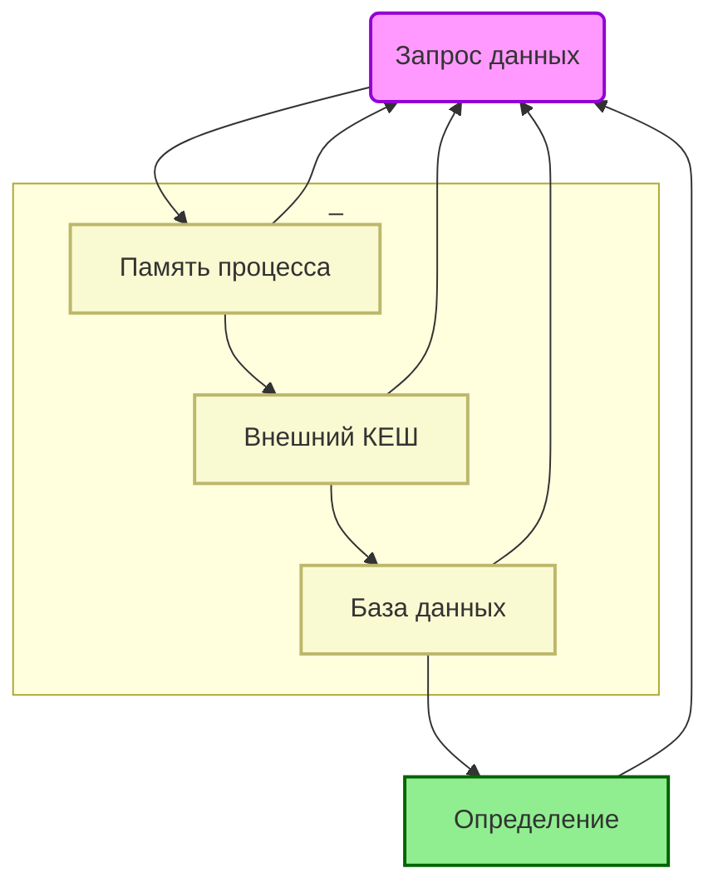

# КЭШирование

```mermaid
    flowchart TB
    request(Запрос данных)
    subgraph  _
        memory[Память процесса]
        icache[Внешний КЕШ]
        database[База данных]
    end
    calc[Определение]


    request --> memory
    memory --> request
    memory --> icache
    icache --> request
    icache --> database
    database --> request
    database --> calc
    calc --> request

    classDef REQUEST fill:#f9f,stroke:DarkViolet,stroke-width:2px;
    class request REQUEST

    classDef CACHE fill:LightGoldenrodYellow,stroke:DarkKhaki,stroke-width:2px;
    class memory,icache,database,calc CACHE

    classDef CALC fill:LightGreen,stroke:DarkGreen,stroke-width:2px;
    class calc CALC
```
