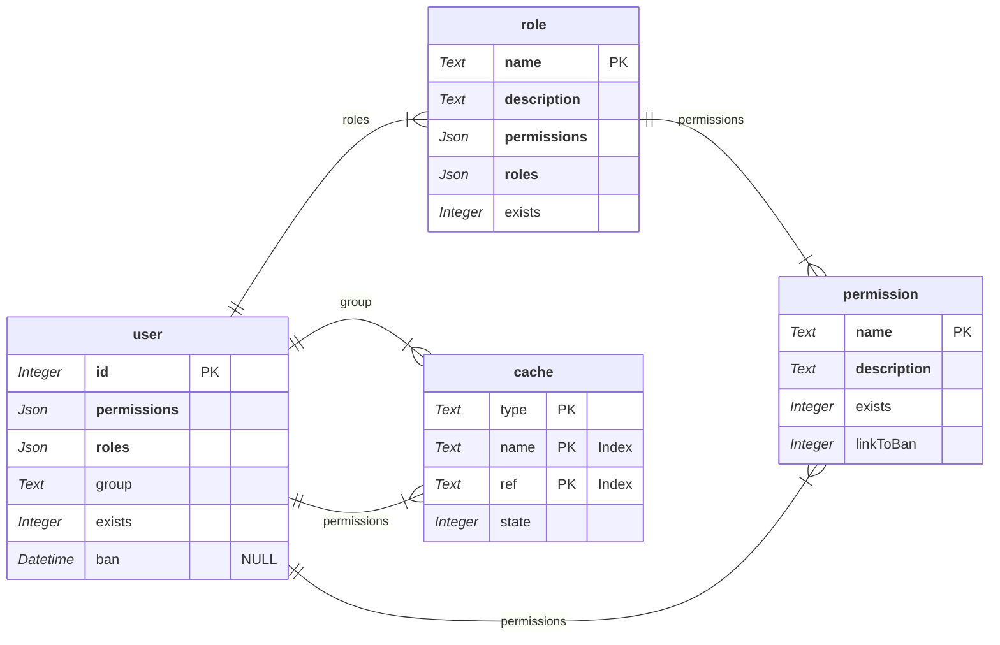

# Проверка прав

```mermaid
erDiagram
    direction LR

    user["**user**"] {
        *Integer* **id** PK
        *Json* **permissions**
        *Json* **roles**
        *Text* group
        *Integer* exists
        *Datetime* ban "NULL"
    }

    role["**role**"] {
        *Text* **name** PK
        *Text* **description**
        *Json* **permissions**
        *Json* **roles**
        *Integer* exists
    }

    permission["**permission**"] {
        *Text* **name** PK
        *Text* **description**
        *Integer* exists
        *Integer* linkToBan
    }

    cache["**cache**"] {
        *Text* type PK
        *Text* name PK "Index"
        *Text* ref PK "Index"
        *Integer* state
    }

    role 1--1+ permission : "permissions"
    user 1--1+ role : "roles"
    user 1--1+ permission : "permissions"
    user 1--1+ cache : "group"
    user 1--1+ cache : "permissions"
```
