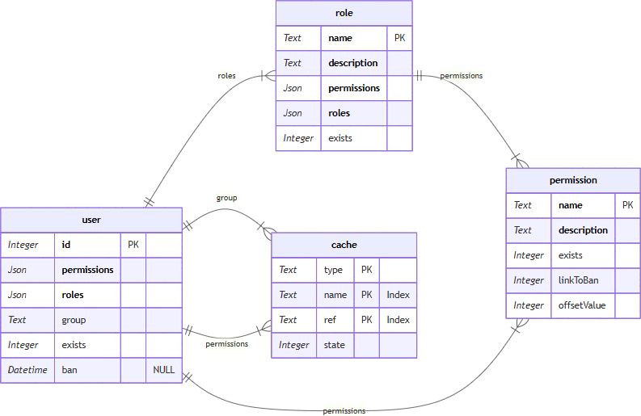
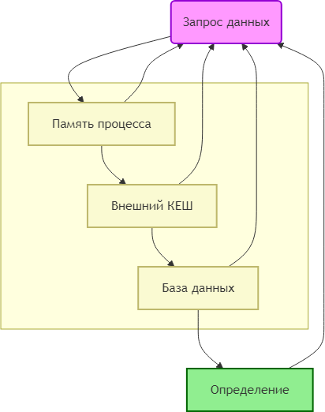

### Введение

На рисунке 1 представлена схема базы данных.

Каждый пользователь `user` с идентификатором **id** может иметь список разрешений **permissions** и ролей **roles**. Каждая роль `role` имеет наименование **name**, описание **description**, список разрешений **permissions** и список дочерних ролей **roles**. Каждое разрешение `permission` имеет имя **name** и описание **description**.

Пользователь имеет все права на разрешения которые присвоены лично ему или его ролям (+дочерние роли его ролей). Т.е. для определения доступных разрешений необходимо собрать все разрешения его ролей, дочерних ролей его ролей и т.д. Процесс этот простой и детального описания не требует. После этого для проверки прав на разрешение достаточно проверить: есть это разрешение в списке пользователя или нет.

Собственно на этом можно было бы и закончить статью. Указанная схема БД и описанные поля уже достаточны для написания системы доступа [RBAC](https://ru.wikipedia.org/wiki/Управление_доступом_на_основе_ролей).
Пример использования:

```php
// Создать сервис с хранилищем в sqlite
$rbac = new Rbac((new SQLiteDatabase('filename'))->create());
// Создать схему ролей и разрешений для пользователя
$p1 = $rbac->permission('p1');
$p2 = $rbac->permission('p2');
$p2 = $rbac->permission('p3');
$R1 = $rbac->permission('R1')->permissionAdd($p1);
$user = $rbac->user(1)->roleAdd($R1)->permissionAdd($p2);
// Сохранить данные в хранилище
$rbac->flush();
// Выполнить проверки
$user->can('p1'); // True
$user->can('p2'); // True
$user->can('p3'); // False
```

Все последующие пункты посвящены ускорению и удобству процесса работы.

### Отложенная загрузка

Суть её в том что объект загружается из БД не в момент создания, а только в момент обращения к его полям. Пример:

```php
    // Создаём две объекта разрешений
    $p1 = $rbac->permission('p1');
    $p2 = $rbac->permission('p2');
    // Только при выполнении кода ниже происходит запрос данных из БД
    // При этом запрашиваются сразу все созданные ранее объекты
    // Т.е. в данном случае из БД будут прочитаны разрешения p1 и p2
    $desc = $p1->getDescription();
```

При этом объект кэшируется в памяти для дальнейшей работы. Такой подход позволяет:

1. Не загружать один и тот же объект несколько раз.
2. Не выполнять загрузку объекта без необходимости
3. Выполнять один запрос для загрузки нескольких объектов

### Удаление

Процесс удаления обычно простой - удалить строку в БД. И для объекта `user` это действительно так. Однако в случае удаления объектов `roles` или `permission` необходимо не просто их удалить, а удалить все ссылки на них в родительских ролях и у пользователей для чего возникает необходимость в переборе всех пользователей и ролей. Поэтому объект не удаляется физически из БД, а помечается как удаленный с помощью сброса флага **exits**. При сборе всех разрешений пользователя проверяется этот флаг и роль/разрешение включается в список только если объект существует.
Пример:

```php
// Создать схему ролей и разрешений для пользователя
$p1 = $rbac->permission('p1');
$p2 = $rbac->permission('p2');
$R1 = $rbac->permission('R1')->permissionAdd($p1);
$user = $rbac->user(1)->roleAdd($R1)->permissionAdd($p2);
// Сохранить данные в хранилище
$rbac->flush();
// Выполнить проверки
$user->can('p1'); // True
$user->can('p2'); // True
// Удалить разрешение
$p2->delete();
// Сохранить данные в хранилище
$rbac->flush();
// Выполнить проверки
$user->can('p1'); // True
$user->can('p2'); // False так как разрешение удалено
```

### Бан пользователя

При бане у пользователя отбирают какие-то права на разрешения, которые он не может выполнять пока бан не закончится. Пример:

```php
// Проверить что пользователь не в бане и имеет право на разрешение p1
$rc = !$user->ban() && $user->can('p1'); // True
// Забанить пользователя на 5 часов
$user = $rbac->user(1)->setBan(new \Datetime('+5 hours'));
// Проверить что пользователь не в бане и имеет право на разрешение p1
$rc = !$user->ban() && $user->can('p1'); // False
// Снять бан
$user = $rbac->user(1)->setBan(null);
```

Если бан не снимать, то он снимается автоматически по истечении указанного времени.
Схема проверки прав на разрешение с баном будет всегда одна и та же: проверяем что пользователь не в бане + проверяем право на разрешение. Поэтому добавлена возможность устанавливать для разрешения связь с баном. Если связь установлена, то при установке бана при проверке разрешения будет автоматически выполняться проверка бана. Код ниже делает тоже самое что в предыдущем примере:

```php
// Установить связь с баном
$p1 = $rbac->permission('p1')->setLinkToBan(true);
// Проверить что пользователь не в бане и имеет право на разрешение p1
$rc = $user->can('p1'); // True
// Забанить пользователя на 5 часов
$user = $rbac->user(1)->setBan(new \Datetime('+5 hours'));
// Проверить что пользователь не в бане и имеет право на разрешение p1
$rc = $user->can('p1'); // False
// Снять бан
$user = $rbac->user(1)->setBan(null);
```

### Кэширование

Самый оптимальный вариант ускорить работу - это сохранять данные во внешнем кэше через интерфейс [CacheItemPoolInterface](https://www.php-fig.org/psr/psr-6/).

Кешируются данные пользователя. При изменении роли или разрешения (его удалении) возникает необходимость сбрасывать кеши всех пользователей в которых эта роль/разрешение используется. Чтобы минимизировать количество сбрасываемых КЕШей роли пользователя сохраняем отдельно. Для этого роли группируем в группу (список уникальных ролей). В данных пользователя сохраняем группу. Так как количество групп будет меньше чем количества пользователей, то и сбрасывать приходится меньше элементов кеша.

Для сброса элементов кеша нам необходимо сохранять все связи разрешение->пользователь, роль->группа, разрешение->группа. Лоя этого служит таблица `cache`. Также эта таблица служит как ещё один слой кеширования.

Схема кеширования выглядит следующим образом



При запросе данных они сначала ищутся в памяти процесса. Если их нет, то проверяется их наличие во внешнем кеше. Если и там нет, то данные ищутся в базе данных. И только если данные и там не обнаружены, то идет определение данных для проверки прав. После чего результат записывается в каждый уровень кеша.

### Список значений

Допустим у нас есть список статей, но мы хотим ограничить пользователям доступ к некоторым статьям. Для этого вводим, к примеру, тип статьи. И для каждого типа заводим своё разрешение.

```php
$p1 = $rbac->permission('article.cpp');
$p2 = $rbac->permission('article.net');
$p3 = $rbac->permission('article.js');
```

После этого при запросе статьи достаточно прочитать её тип и проверить наличие соответствующего разрешения у пользователя. Однако нам нужен список доступных пользователю типов для получения списка статей пользователя. Для этого необходимо получить список доступных пользователю разрешений и отфильтровать те, что начинаются с "article.".
Для удобства добавлен специальный функционал.

```php
$p1 = $rbac->permission('article.cpp')->setPrefixValue('article.');
$p2 = $rbac->permission('article.net')->setPrefixValue('article.');
$p3 = $rbac->permission('article.js')->setPrefixValue('article.');

$types = $rbac->user(1)->values('article.');
```

Данные с указанным префиксом кешируются, что ускоряет работу с ними.

### Работа с любой БД

Хотя в статье фигурирует база данных, но на самом деле можно использовать своё хранилище. Для этого достаточно реализовать интерфейс хранилища:

```php
interface IStorage
{
    public function onFlush(array $actions): void;
    public function onReset(): void;

    public function onReadPermission(array $contexts): void;
    public function onReadAllPermission(int $maxRecords, callable $cb): void;

    public function onReadRole(array $contexts): void;
    public function onReadAllRole(int $maxRecords, callable $cb): void;

    public function onReadUser(array $contexts): void;
    public function onReadAllUser(int $maxRecords, callable $cb): void;

    public function onCacheRead(string $type, string $name): ?array;
    public function onCacheWrite(string $type, string $name, array $refs): void;
    public function onCacheGets(string $type, array $refs, int $maxRecords, callable $cb): void;
    public function onCacheRemove(string $type, array $names): void;
}
```

Т.е. чтобы работать с произвольной БД достаточно написать под него хранилище. В стандартной поставке идет хранилище для [sqlite](https://www.sqlite.org/).

Ссылка на [пакет на github](https://github.com/shasoft/rbac)
