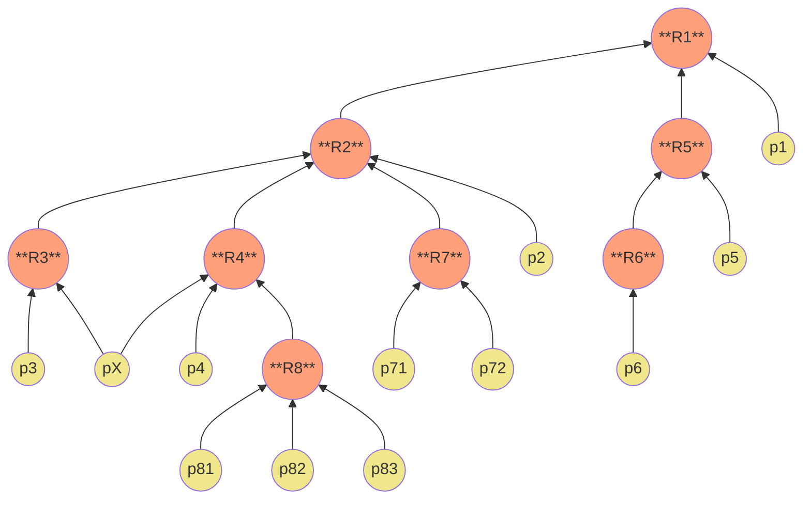
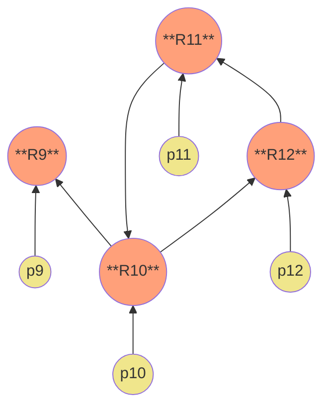

https://mermaid.js.org/syntax/flowchart.html

### Схема тестовой системы ролей

```mermaid
flowchart BT

R1(("**R1**"))
R2(("**R2**"))
R3(("**R3**"))
R4(("**R4**"))
R5(("**R5**"))
R6(("**R6**"))
R7(("**R7**"))
R7(("**R7**"))
R8(("**R8**"))

p1(("p1"))
p2(("p2"))
p3(("p3"))
p4(("p4"))
p5(("p5"))
p6(("p6"))
p71(("p71"))
p72(("p72"))
p81(("p81"))
p82(("p82"))
p83(("p83"))
pX(("pX"))

R2 --> R1
R3 --> R2
R4 --> R2
R7 --> R2
R5 --> R1
R6 --> R5

p1 --> R1
p2 --> R2
p3 --> R3
pX --> R3
pX --> R4
p4 --> R4
p5 --> R5
p6 --> R6
p71 --> R7
p72 --> R7

R8 --> R4
p81 --> R8
p82 --> R8
p83 --> R8

classDef default fill:LightSalmon
classDef permission fill:Khaki

class p1,p2,p3,p4,p5,p6,p71,p72,p81,p82,p83,pX permission
```

```mermaid
flowchart BT

R9(("**R9**"))
R10(("**R10**"))
R11(("**R11**"))
R12(("**R12**"))

p9(("p9"))
p10(("p10"))
p11(("p11"))
p12(("p12"))

p12 --> R12

R12 --> R11
R11 --> R10
R10 --> R12
R10 --> R9

p9 --> R9
p10 --> R10
p11 --> R11

classDef default fill:LightSalmon
classDef permission fill:Khaki

class p1,p2,p3,p4,p5,p6,p71,p72,p81,p82,p83,pX,p9,p10,p11,p12 permission
```
